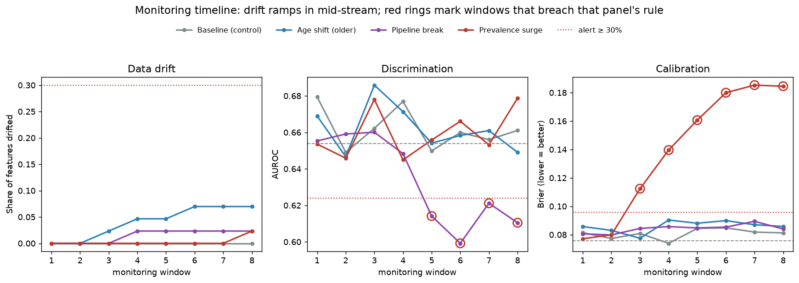

# Readmission Risk & Drift Monitoring

 

A 30-day hospital readmission model wrapped in the governance layer production
healthcare AI actually requires: subgroup fairness auditing, explainability,
calibration and net-benefit analysis, and a live monitoring dashboard that
tracks drift and model performance over time and raises tiered retraining
alerts.

**The point isn't the AUC. The point is everything around it.** Most healthcare
ML demos stop at "I trained a model and got X AUC." Real clinical AI fails
*after* deployment — the population shifts, a pipeline silently breaks, the
model meets a hospital it was never validated on — and nobody notices until
people are affected. This project builds the part that notices.

## What's inside

- 🧮 **Readmission model** — logistic-regression baseline + XGBoost on the UCI
  Diabetes 130-US Hospitals dataset.
- 📈 **Honest evaluation** — AUROC/AUPRC, calibration (Brier), and
  decision-curve / net-benefit analysis.
- ⚖️ **Fairness audit** — per-subgroup performance and disparity metrics
  (Fairlearn) across race, gender, and age.
- 🔍 **Explainability** — global and per-prediction SHAP.
- 🚨 **Drift monitoring** — simulated production streams, tiered
  OK → WARNING → RETRAIN alerting, per-feature drift attribution (Evidently),
  and an automated, logged retraining trigger.
- 📋 **Model card** — written to TRIPOD+AI structure
  ([`models/model_card.md`](models/model_card.md)).
- 🐳 **Reproducible** — one-command Docker run.

## Quickstart

```bash
git clone https://github.com/A6harris/Readmission_Risk_Drift_model_dashboard.git
cd Readmission_Risk_Drift_model_dashboard

# option A: local
python -m venv .venv && source .venv/bin/activate   # Windows: .venv\Scripts\activate
pip install -r requirements.txt
python src/run_pipeline.py          # data prep -> train -> evaluate -> fairness -> explain -> drift
streamlit run src/monitor_app.py    # launch the dashboard at http://localhost:8501

# option B: docker (builds all artifacts into the image, then serves the dashboard)
docker build -t readmission-monitoring .
docker run --rm -p 8501:8501 readmission-monitoring
```

The pipeline downloads the dataset automatically. Run a single phase with
`python src/run_pipeline.py --only drift`, or use the `Makefile`
(`make pipeline`, `make app`, `make test`). To deploy (Streamlit Community
Cloud, Hugging Face Spaces, Docker), see [`DEPLOY.md`](DEPLOY.md).

## The monitoring story

Each drift scenario plays out as a stream of monitoring windows — weekly
batches of production scoring data — compared against a validated reference
window. The shift begins mid-stream and ramps up, the way real drift arrives:

| Scenario | What it simulates |
|---|---|
| `baseline` | Control: resampled production data, no shift |
| `age_shift` | The population skews older — a new catchment area |
| `pipeline_break` | The model's top feature collapses to a default as a broken upstream job rolls out |
| `prevalence_surge` | Readmissions spike, COVID-style — label shift with almost no feature drift |

Every window is scored against an explicit, auditable alert policy:

- **Rules** — data drift (≥ 30 % of features drifted), discrimination (AUROC
  falls ≥ 0.03), calibration (Brier rises ≥ 0.02).
- **Tiers** — **WARNING** when a metric passes 50 % of the way to its
  threshold; **RETRAIN** on breach.
- **Sustained-breach confirmation** — a retraining recommendation requires ≥ 2
  consecutive breaching windows, so one noisy week never trips it.



The final, fully-shifted window of each scenario gets a full Evidently report
with per-feature drift attribution — an alert tells you *which* fields moved,
not just that something did:


The scenarios are designed so each detector earns its place. The benign
`age_shift` is *detected but never flagged for retraining* — it holds at
WARNING. `pipeline_break` barely registers as data drift (one column of 43)
but trips the AUROC rule. `prevalence_surge` breaks calibration with
essentially no feature drift at all — label shift is invisible to
feature-drift monitoring and must be caught by performance tracking. Both
harmful cases are failures that pure data-drift monitoring would miss.

**Closing the loop:** [`src/retrain_trigger.py`](src/retrain_trigger.py)
retrains when the policy is breached and appends every decision — acted on or
not — to an audit log, which the dashboard displays.

## Results at a glance

_Held-out test set (n = 13,998), 30-day readmission prevalence ≈ 9.0 %._

| | AUROC | AUPRC | Brier |
|---|---|---|---|
| Logistic regression (baseline) | 0.651 | 0.173 | — |
| **XGBoost (selected)** | **0.658** | **0.187** | **0.0785** |

The AUROC is modest **by design** — 30-day readmission is genuinely hard to
predict from administrative data, and a suspiciously high number would be the
red flag. What matters is that the model is **calibrated** (Brier 0.0785 beats
the no-skill baseline of 0.0817) and adds **net benefit** across a realistic
outreach threshold band (~3 %–51 %).

| Calibration | Net benefit (decision curve) |
|---|---|
|  |  |

**Explainability.** The strongest SHAP drivers are `discharge_disposition_id`
and `medical_specialty`; `discharge_disposition_id` is **flagged for
leakage/shortcut scrutiny**.

**Fairness.** Calibration holds across subgroups, but reliability varies most
by **age** (recall gap ≈ 0.35). The smallest subgroups are too small (n < 100)
to estimate reliably — itself a key finding.

| SHAP importance | Fairness by age |
|---|---|
|  |  |

Full details: [`models/model_card.md`](models/model_card.md).

## Design grounding

The architecture traces to the clinical-AI literature: models drift silently
after deployment [[1]](#references), and the COVID era showed it happening to a
deployed sepsis model [[6]](#references) — hence the monitoring scenarios.
Post-deployment surveillance is an underbuilt discipline of its own
[[2]](#references)[[8]](#references)[[11]](#references) — this dashboard is a
small, concrete instance of it. External validation repeatedly finds deployed models
underperforming, unevenly across sites and populations
[[3]](#references)[[4]](#references) — hence the subgroup audit. Accuracy
isn't value: usefulness depends on net benefit under real resource constraints
[[5]](#references)[[9]](#references) — hence the decision curve. Reporting
follows TRIPOD+AI [[7]](#references), informed by PROBAST+AI
[[10]](#references).

## Data

**UCI Diabetes 130-US Hospitals (1999–2008)** — ~101,766 inpatient encounters
with demographics, diagnoses, medications, and prior utilization (Strack et
al., 2014 [[12]](#references)). The target is collapsed to binary *readmitted
within 30 days*. This is a public research dataset used for demonstration only
— not real patient data.

## Responsible AI

- **Intended use.** Decision *support* for prioritizing care-management
  outreach. A research/portfolio demonstration, not a validated clinical tool.
- **Prohibited uses.** Must **never** be used to gate, deny, or delay coverage,
  benefits, or access to care; not validated for any autonomous decision.
- **Known limitations.** Historical (1999–2008), single-source data; weakest
  for small subgroups (n < 100) and the `[30-40)` age band; leans heavily on
  `discharge_disposition_id` (leakage audit warranted); not externally
  validated on any current population.
- **To deploy responsibly** would require prospective local validation, active
  drift monitoring (the kind prototyped here), subgroup performance within
  acceptable bounds, and a clinician in the loop for every individual decision.

## Repo structure

```
├── src/
│   ├── data_prep.py        # download, clean, de-duplicate, split
│   ├── train.py            # LR baseline + XGBoost in one pipeline
│   ├── evaluate.py         # AUROC/AUPRC, calibration, net benefit
│   ├── fairness.py         # subgroup metrics (Fairlearn)
│   ├── explain.py          # SHAP global + local
│   ├── drift.py            # windowed drift simulation + tiered alert policy
│   ├── monitor_app.py      # Streamlit monitoring dashboard
│   ├── retrain_trigger.py  # drift-driven retraining + audit log
│   └── run_pipeline.py     # run every phase in order
├── models/                 # model card, metrics; model.joblib is gitignored
├── reports/                # evaluation / fairness / drift summaries
├── docs/figures/           # curated figures for this README
├── tests/                  # pytest suite
└── Dockerfile / Makefile / DEPLOY.md
```

## References

1. Finlayson SG, et al. **The Clinician and Dataset Shift in Artificial Intelligence.** *N Engl J Med.* 2021;385(3):283-286.
2. Ansari S, Baur B, Singh K, Admon AJ. **Challenges in the Postmarket Surveillance of Clinical Prediction Models.** *NEJM AI.* 2025;2(5).
3. Wong A, et al. **External Validation of a Widely Implemented Proprietary Sepsis Prediction Model in Hospitalized Patients.** *JAMA Intern Med.* 2021;181(8):1065-1070.
4. Lyons PG, et al. **Factors Associated With Variability in the Performance of a Proprietary Sepsis Prediction Model Across 9 Networked Hospitals in the US.** *JAMA Intern Med.* 2023;183(6):611-612.
5. Singh K, Shah NH, Vickers AJ. **Assessing the net benefit of machine learning models in the presence of resource constraints.** *J Am Med Inform Assoc.* 2023;30(4):668-673.
6. Wong A, et al. **Quantification of Sepsis Model Alerts in 24 US Hospitals Before and During the COVID-19 Pandemic.** *JAMA Netw Open.* 2021;4(11):e2135286.
7. Collins GS, et al. **TRIPOD+AI statement.** *BMJ.* 2024;385:e078378.
8. Corbin CK, et al. **A framework and case study for monitoring deployed AI systems in health care** (Stanford RAIL). 2025.
9. Vickers AJ, Elkin EB. **Decision curve analysis: a novel method for evaluating prediction models.** *Med Decis Making.* 2006;26(6):565-574.
10. Moons KGM, et al. **PROBAST+AI.** *BMJ.* 2025;388:e082505.
11. Shah NH, et al. **A Nationwide Network of Health AI Assurance Laboratories.** *JAMA.* 2024;331(3):245-249.
12. Strack B, et al. **Impact of HbA1c Measurement on Hospital Readmission Rates.** *BioMed Research International.* 2014;2014:781670.

## License

[MIT](LICENSE).
