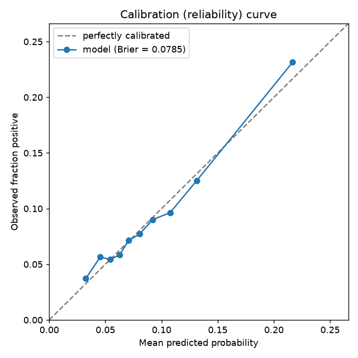
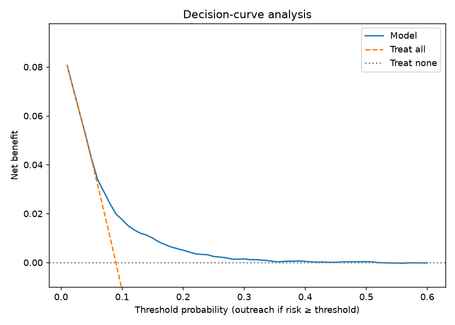
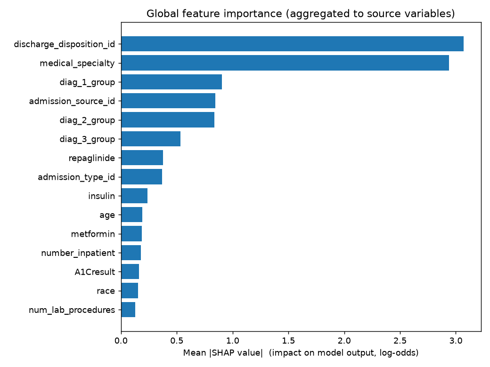
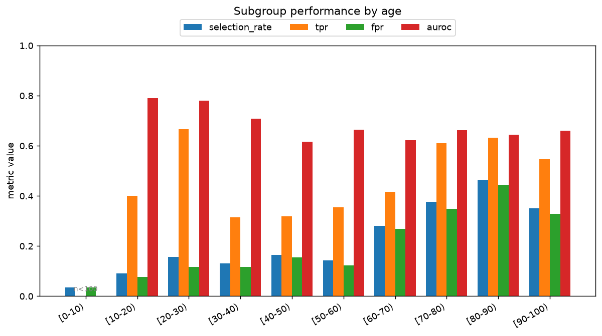
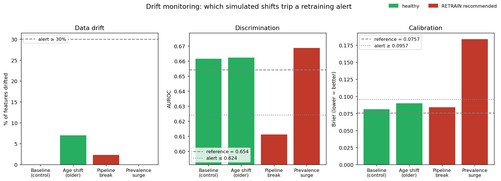

# Readmission Risk + Drift Monitoring

> A 30-day hospital readmission risk model wrapped in the governance layer that production healthcare AI actually requires: subgroup fairness auditing, explainability, calibration & net-benefit analysis, and a live dashboard that detects dataset drift and raises retraining alerts.
>
> **The point isn't the AUC. The point is everything around it.**

<!-- TODO: record a demo GIF of the monitoring dashboard tripping a "RETRAIN
     RECOMMENDED" alert (run `streamlit run src/monitor_app.py`, switch the
     Monitoring tab to "pipeline_break" / "prevalence_surge"), save it as
     docs/demo.gif, and uncomment the line below. This is the single most
     important visual in the repo. -->
<!--  -->

> 📊 _Static result figures are shown under **[Results at a glance](#results-at-a-glance)** below; the live dashboard is one command away (see **[Quickstart](#quickstart)**)._

<!-- TODO: add badges once set up, e.g.: -->
<!--   [](YOUR_DEPLOY_URL) -->

---

## Why this project exists

Most healthcare ML demos stop at "I trained a model and got X AUC." Real clinical AI fails somewhere more interesting: **after** deployment — when the patient population shifts, a data pipeline silently changes, or the model meets a hospital it was never validated on — and nobody notices until people are affected.

This project builds a readmission risk model and then surrounds it with the things a health system needs before it would ever trust such a model in production:

- **A fairness audit** across demographic subgroups, because a single headline metric hides wide variation in who the model serves well.
- **Explainability** (SHAP), so a clinician can see *why* a prediction was made.
- **Calibration and net-benefit analysis**, because a model's value depends on whether you can act on it under real resource constraints — not on AUC alone.
- **Continuous drift monitoring**, because the most dangerous model failures are the ones that happen quietly, months after launch.

This mirrors how leading academic health systems now talk about governing AI: *validate locally, monitor continuously, keep a human in the loop.*

## Background

The architecture of this project is grounded in the clinical-AI literature rather than invented from scratch. The decisions below each trace to specific findings:

**Models drift, and the failure is silent.** Performance degrades when the deployment distribution diverges from training data — the central argument of Finlayson et al.'s *The Clinician and Dataset Shift in Artificial Intelligence* [[1]](#references). The COVID-19 era is a real-world example: a deployed sepsis model's alert behavior shifted measurably during the pandemic [[6]](#references). The monitoring dashboard in this project simulates exactly these scenarios.

**Post-deployment surveillance is its own discipline — and an underbuilt one.** Ansari, Baur, Singh & Admon describe how monitoring of clinical prediction models remains under-specified in practice [[2]](#references); the Stanford team's monitoring framework operationalizes what continuous oversight should look like [[8]](#references). This dashboard is a small, concrete instance of that idea.

**A single metric hides who the model fails.** External validation repeatedly shows deployed models performing far worse than advertised [[3]](#references), and performance can vary dramatically across institutions and populations [[4]](#references). The subgroup fairness audit applies that local-validation principle to demographics.

**Accuracy isn't value.** A model is only useful if you can act on its outputs given finite staff and resources — the case made by Singh, Shah & Vickers on net benefit under resource constraints [[5]](#references), building on decision-curve analysis [[9]](#references). That's why evaluation here includes a decision-curve plot, not just discrimination metrics.

**Report to a standard.** The model card follows the TRIPOD+AI reporting guidance [[7]](#references) and is informed by the PROBAST+AI risk-of-bias framework [[10]](#references).

## Features

- 🧮 **Readmission model** — interpretable logistic-regression baseline + gradient-boosted main model on the UCI Diabetes 130-US Hospitals dataset.
- ⚖️ **Fairness audit** — per-subgroup performance and disparity metrics (Fairlearn) across race, gender, and age.
- 🔍 **Explainability** — global and per-prediction SHAP.
- 📈 **Honest evaluation** — AUROC/AUPRC, calibration (Brier), and decision-curve / net-benefit analysis.
- 🚨 **Drift monitoring dashboard** — simulate population, pipeline, and prevalence shifts; detect them (Evidently); trip a clear retraining alert.
- 📋 **Model card** — written to TRIPOD+AI structure.
- 🐳 **Reproducible** — one-command Docker run.

## Quickstart

```bash
# clone
git clone https://github.com/{{your-username}}/readmission-monitoring.git
cd readmission-monitoring

# option A: local
python -m venv .venv && source .venv/bin/activate   # Windows: .venv\Scripts\activate
pip install -r requirements.txt
python src/run_pipeline.py          # data prep -> train -> evaluate -> fairness -> explain -> drift
streamlit run src/monitor_app.py    # launch the dashboard

# option B: docker (builds all artifacts into the image, then serves the dashboard)
docker build -t readmission-monitoring .
docker run --rm -p 8501:8501 readmission-monitoring
```

Then open http://localhost:8501. The pipeline downloads the dataset
automatically. You can also run a single phase, e.g.
`python src/run_pipeline.py --only drift`, or use the `Makefile`
(`make pipeline`, `make app`, `make test`).

**Deploy it.** See [`DEPLOY.md`](DEPLOY.md) for Streamlit Community Cloud,
Hugging Face Spaces, and Docker. The app can self-provision its artifacts on a
fresh host (set `AUTO_BOOTSTRAP=1`). To close the loop, schedule
[`src/retrain_trigger.py`](src/retrain_trigger.py) — it retrains when the drift
policy is breached and logs each decision.

<!-- TODO: if you deploy to Streamlit Community Cloud / HF Spaces, link the live demo here. -->

## Results at a glance

_Held-out test set (n = 13,998), 30-day readmission prevalence ≈ 9.0%._

| | AUROC | AUPRC | Brier |
|---|---|---|---|
| Logistic regression (baseline) | 0.651 | 0.173 | — |
| **XGBoost (selected)** | **0.658** | **0.189** | **0.0785** |

The AUROC is modest **by design** — 30-day readmission is genuinely hard to
predict from administrative data, and a suspiciously high number would be theng
red flag. What matters is that the model is **calibrated** (Brier 0.0785 beats
the no-skill baseline of 0.0817) and adds **net benefit** across a realistic
outreach threshold band (~4%–58%).

| Calibration | Net benefit (decision curve) |
|---|---|
|  |  |

**Explainability (SHAP).** The strongest drivers are `discharge_disposition_id`
and `medical_specialty` — confirmed at both the aggregated and per-column level.
Raw prior-utilization counts rank lower than the literature expects, and
`discharge_disposition_id` is **flagged for leakage/shortcut scrutiny**.



**Fairness.** Calibration holds across subgroups, but reliability varies most by
**age** (recall gap ≈ 0.35; selection rate climbs steeply with age). Several race
subgroups are too small (n < 100) to draw conclusions — itself a key finding.



**Monitoring.** Simulated shifts show the system distinguishes benign from
harmful drift: a benign **age shift** is detected but not flagged; a **pipeline
break** trips the AUROC rule; a **prevalence surge** (COVID-like) breaks
calibration with *zero* feature drift — a label shift invisible to feature-drift
monitoring but caught by performance tracking, which trips **RETRAIN
RECOMMENDED**.



_Bars are coloured by each scenario's overall retraining verdict (green =
healthy, red = retrain). The dashed lines mark the validated reference; the
dotted lines mark the alert thresholds. Read it left to right: `pipeline_break`
fails on **discrimination** (AUROC drops below tolerance), while
`prevalence_surge` fails on **calibration** (Brier blows past tolerance) despite
**no feature drift at all** — the failure that pure data-drift monitoring would
miss. The live, interactive version (with the full Evidently report per scenario)
is the **🚨 Monitoring** tab of the dashboard._

See the full model card in [`models/model_card.md`](models/model_card.md).

## Data

**UCI Diabetes 130-US Hospitals (1999–2008)** — ~101,766 inpatient encounters with demographics, diagnoses, medications, and prior utilization. Origin paper: Strack et al., 2014 [[12]](#references). The target is collapsed to a binary *readmitted within 30 days*. This is a **public research dataset used for demonstration only** — not real member or patient data — and the project should not be construed as a deployable coverage tool. See the responsible-AI notes below.

## Responsible AI

This section is deliberately prominent, because for healthcare AI it matters as much as the model.

- **Intended use.** Decision *support* for prioritizing care-management outreach — i.e., helping a care team decide whom to check in on. It is a research/portfolio demonstration, not a validated clinical tool.
- **Out-of-scope and prohibited uses.** This model must **never** be used to gate, deny, or delay coverage, benefits, or access to care. It is not validated for any autonomous decision-making.
- **Known limitations.** Trained on a historical (1999–2008), single-source dataset. Performance is weakest for small subgroups where there is too little data to estimate reliably (e.g. Asian and "Other" race groups, n < 100) and for the working-age `[40-50)` band, which has the lowest recall. The model also leans heavily on `discharge_disposition_id`, which warrants a leakage/shortcut audit. It is not externally validated on any current population.
- **What would need to be true to deploy responsibly.** Prospective validation on local, contemporary data; an active drift-monitoring process (the kind prototyped here); demographic-subgroup performance within acceptable bounds; and a human clinician in the loop for any individual decision.
- **Failure modes to watch.** Dataset shift over time, distribution differences across sites, and feedback loops where the model's own use changes the population it predicts on.

## Repo structure

```
readmission-monitoring/
├── README.md / PLAN.md / DEPLOY.md
├── requirements.txt
├── Dockerfile / .dockerignore
├── Makefile
├── packages.txt                 # apt deps for Streamlit Cloud (libgomp1)
├── .streamlit/config.toml
├── data/{raw,processed}/        # gitignored; regenerated by the pipeline
├── docs/figures/                # curated figures for this README
├── src/
│   ├── data_prep.py     # load, clean, de-duplicate, split
│   ├── train.py         # LR baseline + XGBoost in one pipeline
│   ├── evaluate.py      # AUROC/AUPRC, calibration, net benefit
│   ├── fairness.py      # subgroup metrics (Fairlearn)
│   ├── explain.py       # SHAP global + local
│   ├── drift.py         # simulate shift + Evidently reports
│   ├── monitor_app.py   # Streamlit dashboard
│   ├── run_pipeline.py  # run every phase in order
│   └── retrain_trigger.py  # drift-driven retraining + event log
├── models/              # model.joblib (gitignored) + model_card.md + metrics.json
├── reports/             # evaluation/fairness/drift JSON + md, Evidently HTML (gitignored)
└── tests/               # pytest sanity checks
```

## References

1. Finlayson SG, Subbaswamy A, Singh K, et al. **The Clinician and Dataset Shift in Artificial Intelligence.** *N Engl J Med.* 2021;385(3):283-286. PMID: 34260843.
2. Ansari S, Baur B, Singh K, Admon AJ. **Challenges in the Postmarket Surveillance of Clinical Prediction Models.** *NEJM AI.* 2025;2(5). PMID: 40873499.
3. Wong A, Otles E, Donnelly JP, et al. **External Validation of a Widely Implemented Proprietary Sepsis Prediction Model in Hospitalized Patients.** *JAMA Intern Med.* 2021;181(8):1065-1070. PMID: 34152373.
4. Lyons PG, Hofford MR, Yu SC, et al. **Factors Associated With Variability in the Performance of a Proprietary Sepsis Prediction Model Across 9 Networked Hospitals in the US.** *JAMA Intern Med.* 2023;183(6):611-612. PMID: 37010858.
5. Singh K, Shah NH, Vickers AJ. **Assessing the net benefit of machine learning models in the presence of resource constraints.** *J Am Med Inform Assoc.* 2023;30(4):668-673. PMID: 36810659.
6. Wong A, Cao J, Lyons PG, et al. **Quantification of Sepsis Model Alerts in 24 US Hospitals Before and During the COVID-19 Pandemic.** *JAMA Netw Open.* 2021;4(11):e2135286. PMID: 34797372.
7. Collins GS, Moons KGM, Dhiman P, et al. **TRIPOD+AI statement.** *BMJ.* 2024;385:e078378. PMID: 38626948.
8. Stanford Health Care. **Monitoring Deployed AI Systems in Health Care** (Responsible AI Lifecycle / RAIL). 2025. arXiv:2512.09048. <!-- TODO: verify exact arXiv ID/title before final citation -->
9. Vickers AJ, Elkin EB. **Decision curve analysis: a novel method for evaluating prediction models.** *Med Decis Making.* 2006;26(6):565-574. PMID: 17099194.
10. Moons KGM, Damen JAA, Kaul T, et al. **PROBAST+AI.** *BMJ.* 2025;388:e082505. PMID: 40127903.
11. Shah NH, Halamka JD, Saria S, et al. **A Nationwide Network of Health AI Assurance Laboratories.** *JAMA.* 2024;331(3):245-249.
12. Strack B, DeShazo JP, Gennings C, et al. **Impact of HbA1c Measurement on Hospital Readmission Rates: Analysis of 70,000 Clinical Database Patient Records.** *BioMed Research International.* 2014;2014:781670.

## License

Released under the [MIT License](LICENSE).

---

<!--
DRAFT NOTES (delete before publishing):
- Replace all {{...}} placeholders and the docs/demo.gif.
- Fill the fairness-audit subgroup finding after Phase 4.
- Lead with the GIF — recruiters skim. The pitch + GIF + Background do the heavy lifting.
- Verify Ref 8's arXiv ID.
- Consider a 2-3 sentence "What I learned" section at the bottom; hiring managers like it.
-->